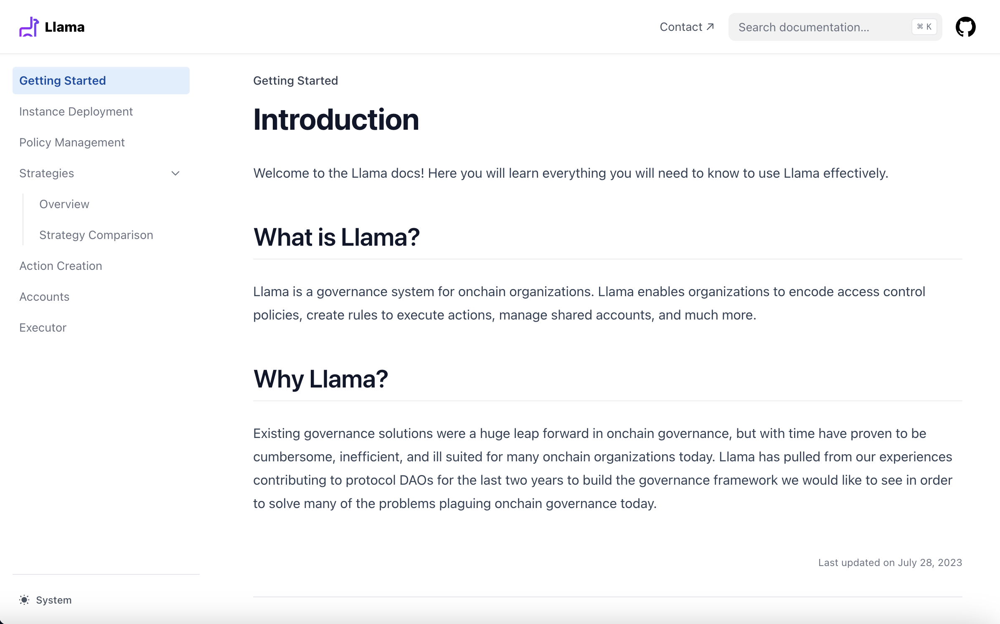

# Llama

Llama is an onchain governance framework. It uses non-transferable NFTs to encode access control, features programmatic control of funds, and includes modular strategies to define action execution rules.

This site was made with [Nextra](https://nextra.site).

[**Live Demo →**](https://llama-docs.vercel.app/)

## Local Development

First, run `pnpm i` to install the dependencies.

Then, run `pnpm dev` to start the development server and visit localhost:3000.
