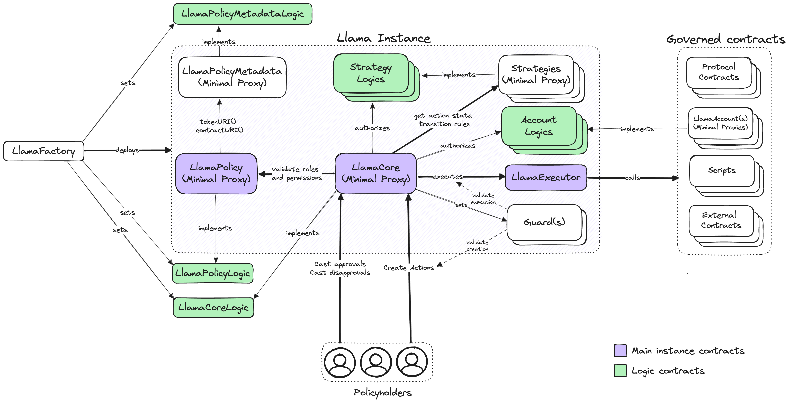

# Overview

A Llama instance consists of a modular system of smart contracts with an immutable core and interchangeable periphery. `LlamaCore` and `LlamaPolicy` work together with strategy and guard contracts to establish and enforce the rules for how actions progress from creation to execution. A successful action execution results in the `LlamaExecutor` calling the specified target contract with the agreed upon transaction calldata. Since the executor is the single exit point of an instance, ownership of external functions only needs to be set once.

Instances can also deploy an arbitrary amount of strategies, accounts, scripts, and guards. Strategies are configured with time period lengths and quorum thresholds that determine how [actions transition between states](/framework/actions#action-state). Accounts are onchain wallets that can receive, transfer, and approve tokens. Scripts are contracts that can be delegatecalled from the executor. This is useful for creating custom instance governance functions that batch multiple operations. Guards are for adding additional safety checks that run at action creation, pre-execution, and post-execution time.

## Next steps

To learn more about how the Llama framework works, read our documentation and use the [forge doc](https://github.com/llamaxyz/llama#documentation) command to generate and view the Llama smart contract reference.

- [Actions](/framework/actions)
- [Policies](/framework/policies)
- [Strategies](/framework/strategies)
- [Accounts](/framework/accounts)
- [Instance deployment](/framework/instance-deployment)
