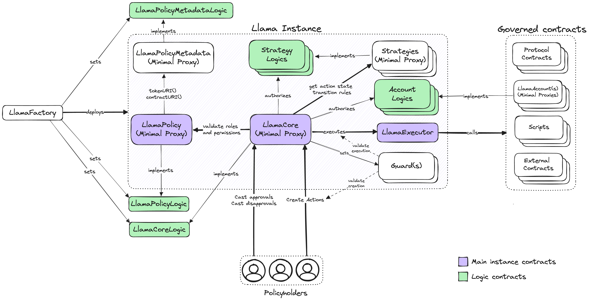

# Introduction

Welcome to the Llama docs! Here, you will learn everything you need to effectively use Llama.

## What is Llama?

Llama is an onchain governance framework. It enables onchain organizations to encode access control policies, create and execute actions, and manage funds programmatically.

## Why Llama?

We have contributed to protocols and onchain communities over the past two years and have experienced first-hand how bad governance design can lead to inefficient decision making, cumbersome processes, and lack of effective decentralization. Llama is built with those learnings in mind — it is the framework we wish we had. Llama helps protocols run their operations with 10 members or 10,000. Through Llama, functions can be permissioned granularly and access control policies can be issued to individuals, multisigs, or token voting DAO contracts.

## Key Concepts

- **Instance**: A Llama instance is a self managed cluster of contracts that enables on-chain access control over priveleged functions. The main parts of an instance are the `Core`, `Policy`, and `Executor` contracts.
- **Policies**: Non-transferable NFTs encoded with roles and permissions for an individual Llama instance. They allow users to create actions, assign roles, authorize strategies, and more.
  - **Roles**: A signifier given to one or more policyholders. Roles can be used to permission action creation, action approvals, and action disapprovals.
  - **Permission IDs**: A unique identifier that can be assigned to roles to permission action creation. Permission IDs are represented as a hash of the target contract, function selector, and strategy contract. Actions cannot be created unless a policyholder holds a role with the correct permission ID.
- **Actions**: Actions are proposed transactions initiated by policyholders that are executed onchain.
- **Strategies**: Contracts that holds all of the logic to determine the rules and state of an action. For example, strategies determine whether or not an action is approved/disapproved, canceled, or able to be executed. They also determine details around who is allowed to cast approvals/disapprovals.
- **Executor**: The single exit point of a Llama instance. The executor address will be the `msg.sender` for any executed actions.

